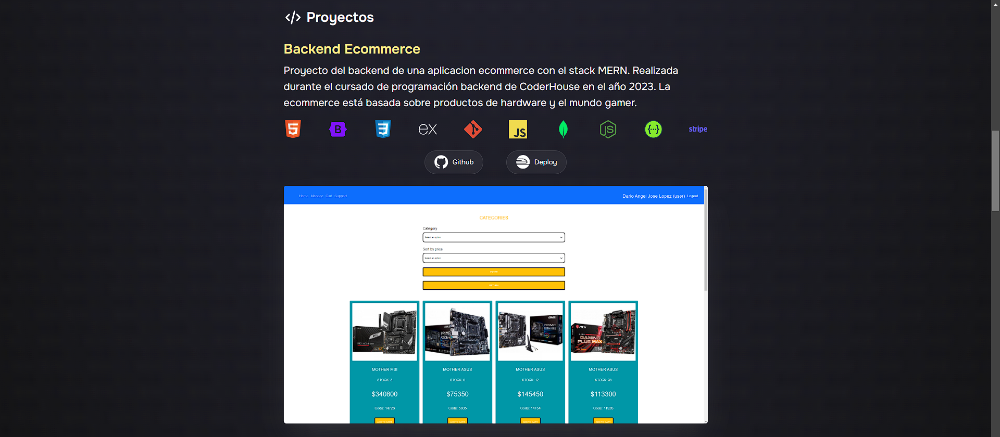

#PortFolio Dario Lopez BackEnd Developer

En este repositorio agrego el código de mi repositorio como programador. Este tiene como objetivo 
compartir información acerca de mis skill y aptitudes. En búsqueda de un puesto en donde pueda 
aportar valor y ayudar a hacer un mundo mejor.

 
    

         
     

#     

    

# Deployment de la aplicación 

* https://portfoliodariolopez.netlify.app/

# Tecnologías utilizadas 💻:

* 
* 
* 
* 
*  

(<a href="#top">Volver Arriba</a>)

